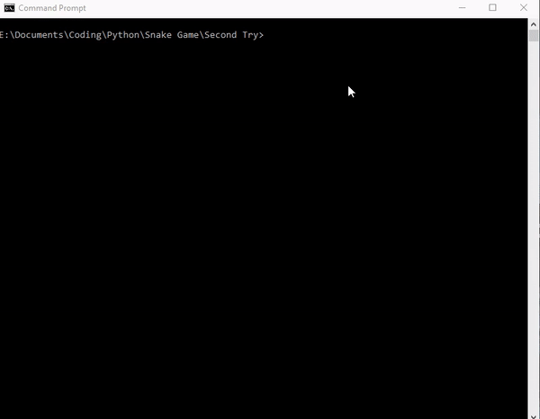

# Snake Game



## Description
A simple snake game. This was the first time that I actually coded a project from absolute scratch. Any tips are much appreciated.

## Installation
1. ```pip install pygame```
2. Fork this repository or copy game.py
3. ```cd C:\Path\to\game.py```
4. ```python game.py```
